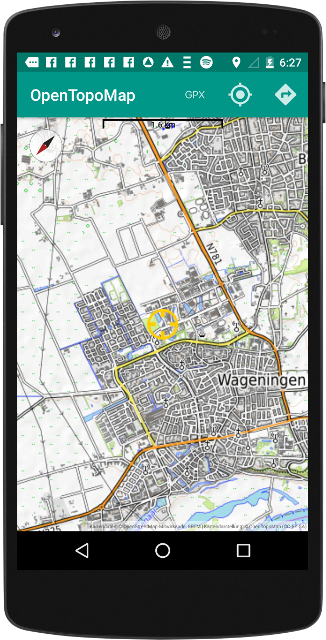
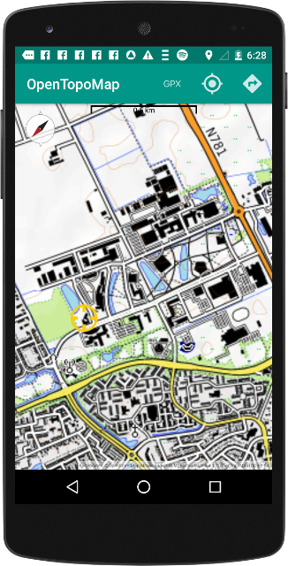
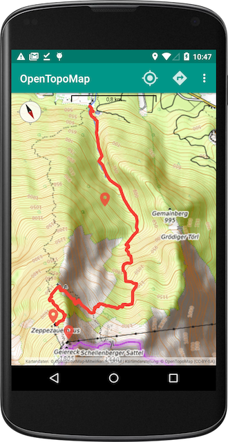
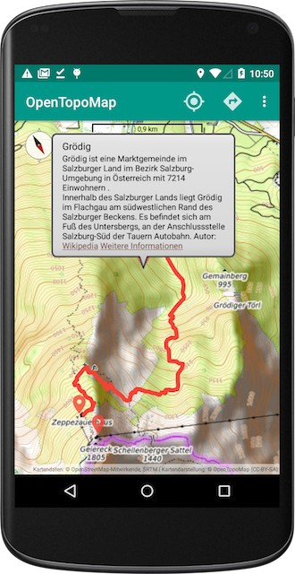
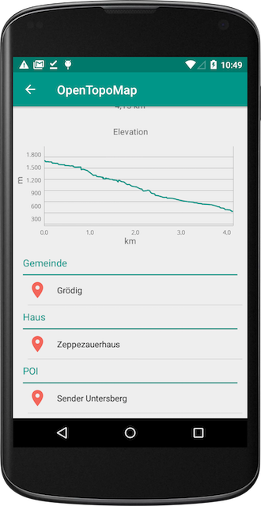

# OpenTopoMapViewer

OpenTopoMap viewer for Android

- Follow location
- Import GPX
- Lonvia hiking routes
- Lonvia cycling routes

Check out this post to learn more about preloading the cache for offline use: [Offline tile ZIP import for OpenTopoMap Viewer](https://pygmalion.nitri.org/preloading-offline-maps-in-opentopomap-viewer-1714.html).

Basic routing with the [ORS Android Client](https://github.com/Pygmalion69/ors-android-client) is an experimental feature: [How to Enable Basic Routing with OpenRouteService (ORS) in OpenTopoMap Viewer](https://pygmalion.nitri.org/how-to-enable-basic-routing-with-openrouteservice-ors-in-opentopomap-viewer-1818.html).

 

 

## Forks and third-party distributions

OpenTopoMap Viewer is open-source software licensed under the Apache License 2.0. The licence permits modification and redistribution, including under a different name.

Please note, however, that third-party forks and rebranded distributions are independent projects. They may contain older versions of OpenTopoMap Viewer, additional modifications, different advertising or analytics components, or different release and signing practices.

This repository is the upstream development project for OpenTopoMap Viewer. Issues, releases and security fixes published here apply to the official OpenTopoMap Viewer builds only.

If you maintain a fork and fix a bug or make a generally useful improvement, contributions back to the upstream project are very welcome.

&nbsp;

(Has ads.)

&nbsp;

(FOSS, no ads.)
